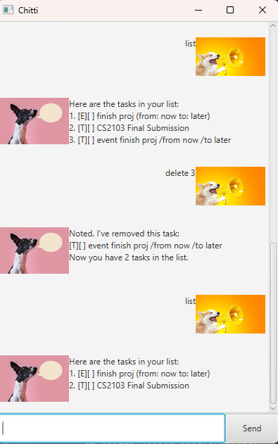

# Taskmax User Guide

# Hello, I am Taskmax 🤖❤️

> "I am your personal task scheduling companion.
My purpose is to keep you organised and stress-free.
On a scale of 1 to 10, how would you rate your productivity?"
> – **Taskmax**

Taskmax is a JavaFX-based task scheduler bot designed to help you manage your tasks efficiently. With Taskmax, you can add, delete, mark, unmark, and sort tasks by priority. It supports three types of tasks: **ToDo**, **Deadline**, and **Event**. Taskmax also saves your tasks automatically, so you never lose track of your schedule!

I am inspired by Baymax 🩺 from Big Hero 6! But instead of healthcare, I take care of your task!

---

## Help Command

If you need a rundown of the available commands, simply type any word that is not a command or `help`.

**Example:**  
`help`

**Expected Output:**
> Hey there! There are 9 things I can help you with!
> 1. List: Enter "list" and I will list out all the tasks you have given me!
> 2. Todo: Enter "todo <theTaskName> priority <number>" to add a task you plan to do!
> 3. Deadlines: Enter "deadline <theTaskName> /by <yyyy-mm-dd> <24hrTime> priority <number>" to add a task with a specific deadline!
> 4. Events: Enter "event <theTaskName> /from <yyyy-mm-dd> <24hrTime> /to <yyyy-mm-dd> <24hrTime> priority <number>" to add an event!
> 5. Delete: Enter "delete <theTaskListNumber>" to delete a task from the list!
> 6. Mark as done: Enter "mark <TaskListNumber>" to mark the task as complete in the list!
> 7. Mark as undone: Enter "unmark <TaskListNumber>" to mark the task as incomplete in the list!
> 8. Find: Enter "find <Word(s)YouWantToFind>" to find tasks that match the keyword in the description.
> 9. Sort: Enter "sort priority" and I will sort the tasks by their priority!
>
> If you need a refresher, just enter any word!  
> If you are satisfied with your service, enter "bye" to save your task list and exit!  
> 
> You can resize my window as you wish and do remember that my input receptors are sensitive  
> so please be careful with your spelling and capital letters for commands!
>
> That is all and happy scheduling! ~Taskmax :D

---

## Adding Tasks 

Taskmax allows you to add three types of tasks: **ToDo**, **Deadline**, and **Event**. Each task can be assigned a priority level (e.g., 1 for high priority, 2 for medium, 3 for low).

---

### - Adding a "ToDo" Task
To add a simple task without a deadline, use the `todo` command.

**Format:**  
`todo <task_description> priority <priority_level>`

**Example:**  
`todo Buy groceries priority 1`

**Expected Output:**
>Got it. I've added the following tasks:  
> [T][ ] Buy groceries (priority 1)  
> Now you have 1 tasks in the list.

---

### - Adding a  "Deadline" Task
To add a task with a specific deadline, use the `deadline` command.

**Format:**  
`deadline <task_description> /by <yyyy-MM-dd HHmm> priority <priority_level>`

**Example:**  
`deadline Individual Project /by 2023-10-15 1800 priority 2`

**Expected Output:**
>Got it. I've added the following tasks:  
> [D][ ] Individual Project (by: Oct 15 2023, 06:00 PM) (priority 2)  
> Now you have 2 tasks in the list.

---

### - Adding an "Event" Task
To add an event with a start and end time, use the `event` command.

**Format:**  
`event <task_description> /from <yyyy-MM-dd HHmm> /to <yyyy-MM-dd HHmm> priority <priority_level>`

**Example:**  
`event Party /from 2023-10-16 1400 /to 2023-10-16 1500 priority 3`

**Expected Output:**
> Got it. I've added the following tasks:  
> [E][ ] Party (from: Oct 16 2023, 02:00 PM to: Oct 16 2023, 03:00 PM) (priority 3)  
> Now you have 3 tasks in the list.

---

## Listing All Tasks

To view all your tasks, use the `list` command.

**Format:**  
`list`

**Example:**  
`list`

**Expected Output:**
> Here are the tasks in your list:  
> 1. [T][ ] Buy groceries (priority 1)  
> 2. [D][ ] Individual Project (by: Oct 15 2023, 06:00 PM) (priority 2)  
> 3. [E][ ] Party (from: Oct 16 2023, 02:00 PM to: Oct 16 2023, 03:00 PM) (priority 3)

---

## Marking a Task as Done

To mark a task as completed, use the `mark` command followed by the task number.

**Format:**  
`mark <task_number>`  
 (with respect to the item number in the list)

**Example:**  
`mark 1`

**Expected Output:**
> Nice! I've marked your task as done.  
> Keep up the good work!

--- 

## Unmarking a Task as Not Done

To mark a task as incomplete, use the `unmark` command followed by the task number.

**Format:**  
`unmark <task_number>`  
(with respect to the item number in the list)

**Example:**  
`unmark 1`

**Expected Output:**
> I've unmarked your task.   
> Don't give up on it yet!

---
## Deleting a Task

To delete a task, use the `delete` command followed by the task number.

**Format:**  
`delete <task_number>`  
(with respect to the item number in the list)

**Example:**  
`delete 2`

**Expected Output:**
> Noted. I've removed this task:  
> [D][ ] Individual Project (by: Oct 15 2023, 06:00 PM) (priority 2)  
> Now you have 2 tasks in the list.

---

## Finding Tasks by Keyword

To search for tasks containing a specific keyword, use the `find` command.

**Format:**  
`find <keyword>`

**Example:**  
`find party`

**Expected Output:**  
> Here are the matching tasks in your list:  
> 3. [E][ ] Party (from: Oct 16 2023, 02:00 PM to: Oct 16 2023, 03:00 PM) (priority 3)

---

## Sorting Tasks by Priority

To sort your tasks by priority, use the `sort` command. It rearranges the list from priority 1 to n.

**Format:**  
`sort priority`

**Example:**  
`sort priority`

**Expected Output:**  
> Here are your tasks sorted by priority:  
> [T][ ] Buy groceries (priority 1)  
> [D][ ] Individual Project (by: Oct 15 2023, 06:00 PM) (priority 2)  
> [E][ ] Party (from: Oct 16 2023, 02:00 PM to: Oct 16 2023, 03:00 PM) (priority 3)

---

## Exiting Taskmax

To save your tasks and exit Taskmax, use the `bye` command   
(Only exits in the CLI Version, not the JavaFX Version)

**Format:**  
`bye`

**Example:**  
`bye`

**Expected Output:**
> Tasks have been saved to my drive!  
> I hope that you are satisfied with your service.   
> See you again soon!

---  

## Saving and Loading Tasks

Taskmax automatically saves your tasks to a file (`data/tasks.txt`) when you exit the application. The next time you start Taskmax, it will load your tasks from this file.

---

## Troubleshooting

- **Invalid Command:** If you enter an invalid command, Taskmax will display a help message with instructions or prevent you from entering the command at all.
- **File Errors:** If Taskmax encounters an error while saving or loading tasks, it will notify you and start with an empty task list.

# Enjoy using Taskmax to stay organized and productive! 🚀

--- 
