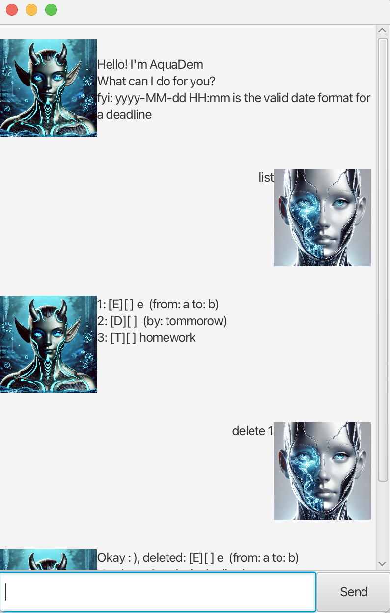

# Tasker User Guide



**Your Ultimate Task Management Companion**

Stay organized, productive, and in control with Tasker, the all-in-one task manager designed to simplify your life. Whether you're managing daily to-dos, tracking deadlines, scheduling events, or handling fixed-duration tasks, Tasker has you covered. With its intuitive interface and powerful features, you'll never miss a beat.

## Input format
* `description`: A string before any ` /`.
* `deadline`/`start`/`end`: `d/m/yyyy HHMM`.
    * `d`: 1 or 2 digit day,
    * `m`: 1 or 2 digit month
    * `yyyy`: 4 digit year
    * `HH`: 2 digit 24H format hour
    * `MM`: 2 digit minutes
* `hr`: An integer.
* `min`: An integer.
* `index`: An integer of a task's index.
* `term`: A string.

# Adding tasks
## Todos
Adds a simple task with a description to be done

### Usage
`todo {description}`

### Example output
```
Got it. I've added this task:
  [T][] Read a book
Now you have 1 tasks in the list.
```
## Deadlines
Adds a task with a description and a deadline to complete it by.

### Usage
`deadline {description} /by {deadline}`

### Expected output
```
Got it. I've added this task:
  [D][] Complete assign (by: Feb 15 2025 1800)
Now you have 2 tasks in the list.
```
## Events
Adds a task with a description, a start and and end time.

### Usage
`event {description} /from {start} /to {end}`

### Expected output
```
Got it. I've added this task:
  [E][] Company meeting (from: Feb 16 2025 1400, to: Feb 16 2025 1800)
Now you have 3 tasks in the list.
```

## Fixed duration tasks
Adds a task with a description and takes a duration to complete.

### Usage
`fixed {description} /hr {hours} /min {min}`

### Expected output
```
Got it. I've added this task:
  [F][] Wash clothes (needs: 1H 45M)
Now you have 4 tasks in the list.
```

# Managing tasks
## Listing
Lists all tasks in the list.

### Usage
`list`

### Expected output
```
Here are the tasks in your list:
1.[T][] Read a book
2.[D][] Complete assign (by: Feb 15 2025 1800)
3.[E][] Company meeting (from: Feb 16 2025 1400, to: Feb 16 2025 1800)
4.[F][] Wash clothes (needs: 1H 45M)
```

## Marking
Marks a task as complete.

### Usage
`mark {index}`

### Expected output
```
Nice! I've marked this task as done:
  [T][X] Read a book
```

## Unmarking
Unmarks a task from being complete.

### Usage
`unmark {index}`

### Expected output
```
Ok, I've marked this task as not done yet:
  [T][] Read a book
```
## Finding
Finds a task containing the string in its description.

### Usage
`finding {term}`

### Expected output
```
Here are the matching tasks in your list:
  [T][X] Read a book
```

### Notes
* Searching is case insensitive.

## Deleting
Deletes a task from the list.

### Usage
`delete {index}`

### Expected output
```
Noted. I've removed this task:
  [T][] Read a book
Now you have 3 tasks in the list.
```

# Storage
Tasks are stored and loaded from the file at `./data/tasker.txt`
